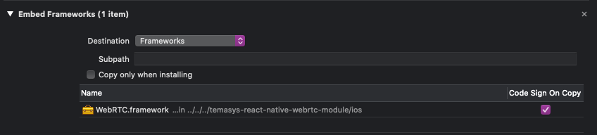

# Building the sample app

### Pre-requisites
- [set up the Android or iOS development environment](https://reactnative.dev/docs/environment-setup)
- `react-native-cli` is installed globally

### Android Installation
- check you are in `react-native-sdk-2.x/sample-app` directory
- `npm install`
- in `/sample-app/android` create a file `local.properties` and add the line `sdk.dir = /Users/USERNAME/Library/Android/sdk`
- in `/sample-app` create a file `app-config.js` and copy the contents of `app-config-example.js` replacing the placeholder values with your own key and secret*
- run `sudo react-native run-android`
- ensure that you have an Android device plugged in and USB debugging enabled 
- grant permission for USB installation when prompted

### iOS Installation
- check you are in `react-native-sdk-2.x/sample-app` directory
- `npm install`
- navigate to `/sample-app/ios` and open `ReactNativeWebRTC.xcodeproj` in Xcode
- in `/sample-app` create a file `app-config.js` and copy the contents of `app-config-example.js` replacing the placeholder values with your own key and secret*

    ### In Xcode

 - Step 1: Add `temasys-react-native-webrtc` library
    - in the `Libraries` panel, if there is an existing `RCTWebRTV.xcodeproj`, delete it
    - right click `Libraries` and click `Add Files to [project]`
    - from project root folder, navigate to `node_modules/temasys-react-native-webrtc/ios/RCTWebRTV.xcodeproj` then `Add`
    
    

 - Step 2: Add Library Search Path
    - click on the main project file in the left panel - the top most file named ReactNativeWebRTC
    - select `Build settings`, scroll down to find `Search Paths`
    - edit BOTH `Framework Search Paths` and `Library Search Paths` entries
    - add path on BOTH sections with: `$(SRCROOT)/../node_modules/temasys-react-native-webrtc/ios` with `recursive`
    
    

 - Step 3: Add `libRCTWebRTC.a` library
    - click `Build Phases` tab and open `Link Binary With Libraries`
    - enter `libRCTWebRTC.a` in the search bar and click `Add`
    
    
    
    - check that the following libraries have been added
        - AVFoundation.framework
        - AudioToolbox.framework
        - CoreGraphics.framework
        - GLKit.framework
        - CoreAudio.framework
        - CoreVideo.framework
        - VideoToolbox.framework
        - libc.tbd
        - libc++.tbd
        - libsqlite3.tbd 
    
    - if they are not, add them following the same steps as `libRCTWebRTC.a`
    - check that `WebRTC.framework` is linked
    
    
    
    - under `Linking` check that `Dead Code Stripping` and under `Build Options` that `Enable Bitcode` are set to `No`
 
 - Step 4: Permissions
    - navigate to `<ProjectFolder>/ios/<ProjectName>/Info.plist`
    - check that `Camera Usage` and `Microphone Usage` are set, otherwise edit to add the values
    
    

 - Step 5:
    - check that you have an iOS device set up
        - [React Native: Running On Device](https://reactnative.dev/docs/running-on-device)
    - click `build` to build and run the app

*Obtain your key from [Temasys Developer's Console](https://console.temasys.io/#)

